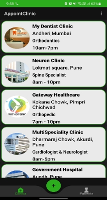

# AppointClinic

PROBLEM :

According to research it was observed that  approx.. 4,300 Indians die daily.  Many people in India are deprived of good healthcare facilities and hospital facilities. The two main reasons found are absence of hospitals in diverse areas and lack of money.

APPROACH:

Hence “AppointClinic” is built with a vision to solve these problem.

An app which allows patients to quickly and simply keep track of their health by accessing the clinics. The means of access could be chatting as well as calling.

# Benefits
` `Search for reliable research-backed answers to your questions about  diseases, symptoms and health procedures. 

` `Easily request an appointment with the world-class experts in top-ranked specialties.

` `The need to visit hospital for minor illness will be reduced, Hence helping many people as well as the government in reaching each and every individual.

CONCLUSON:

Hence with the growing demand for online India, our  vision to contribute to the problem solving idea “AppointClinic” will be helpful to all the needy people.

## Reference

 - [Android Developer Roadmap](https://roadmap.sh/android)
 - [Download Android Studio here](https://developer.android.com/studio/)
 - [Kotlin](https://kotlinlang.org/)
 - [firebase](https://firebase.google.com/)

                                                              

